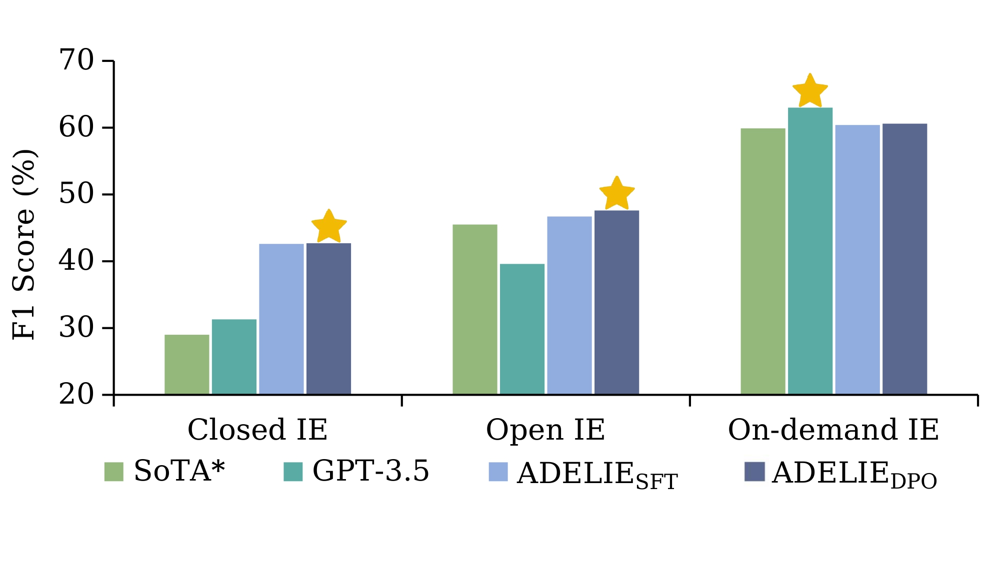
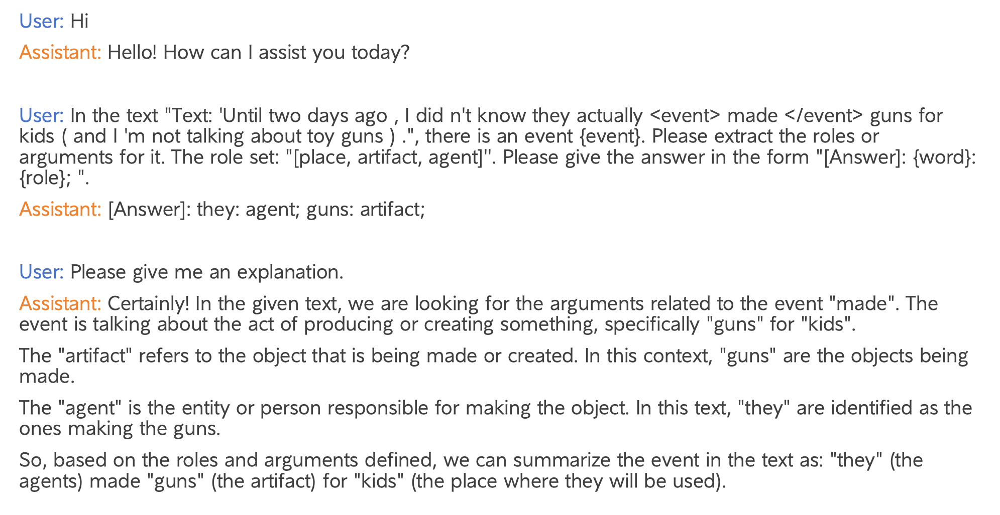

# Aligning Large Language Models on Information Extraction
<p align="center">
    <a href="https://arxiv.org/abs/2405.05008"></a>
    <a href="https://huggingface.co/collections/THU-KEG/adelie-663dba43d21837e0cd21ffef"></a>
    <a href="https://github.com/THU-KEG"></a>
</p>

<p align="justify">
We introduce <b>ADELIE</b> (<b>A</b>ligning large language mo<b>DEL</b>s on <b>I</b>nformation <b>E</b>xtraction), an aligned LLM that effectively solves various IE tasks, including closed IE, open IE, and on-demand IE. We first collect and construct a high-quality alignment corpus <font face="Verdana">IEInstruct</font> for IE. Then we train ADELIE<sub>SFT</sub> using instruction tuning on <font face="Verdana">IEInstruct</font>. We further train ADELIE<sub>SFT</sub> with direct preference optimization (DPO) objective, resulting in ADELIE<sub>DPO</sub>. Extensive experiments on various held-out IE datasets demonstrate that our models (ADELIE<sub>SFT</sub> and ADELIE<sub>DPO</sub>) achieve state-of-the-art (SoTA) performance among open-source models. We further explore the general capabilities of ADELIE, and experimental results reveal that their general capabilities do not exhibit a noticeable decline.

- 📖 Paper: [ADELIE: Aligning Large Language Models on Information Extraction](https://arxiv.org/abs/2405.05008)
- 🐧 ADELIE in the 🤗HuggingFace Hub: [THU-KEG/ADELIE](https://huggingface.co/collections/THU-KEG/adelie-663dba43d21837e0cd21ffef)
- 🌟 IEInstruct and IEFeedback: [Datasets](https://cloud.tsinghua.edu.cn/d/bd28bc9aac1146d0b927/)
</p>

<p align="center">

</p>

## News❗️❗️❗️
- [2024-11-4] To facilitate deployment, we further trained **Qwen2.5-1.5B** (ADELIE-SFT-1.5B and ADELIE-DPO-1.5B) and **Llama3.2-3B** (ADELIE-SFT-3B and ADELIE-DPO-3B). The models are now available on the [HF repository](https://huggingface.co/collections/THU-KEG/adelie-663dba43d21837e0cd21ffef).
- [2024-9-20] Our paper has been accepted by the **EMNLP 2024 main conference**!
- [2024-05-06] Initial release of the codebase containing the data constructing and training code for our [arxiv paper](https://arxiv.org/abs/2405.05008).


## An inference example
<p align="center">

</p>

## Installation
The code repository is based on Pytorch and Transformers. Please use the following command to install the necessary dependcies. ``pip install -r requirements.txt.``

## Pretrained models
We release three ADELIE models based on [LLama-2](https://huggingface.co/docs/transformers/main/model_doc/llama2) (7B), [Llama-3.2](https://huggingface.co/meta-llama/Llama-3.2-3B) (3B) and [Qwen2.5](https://huggingface.co/Qwen/Qwen2.5-1.5B) (1.5B). The models are available in the 🤗HuggingFace Hub.

The table below presents the average F1 scores (%) of the ADELIE model across closed IE, open IE, and on-demand IE tasks, as well as its overall performance (%) on general benchmarks. For dataset details, please refer to the paper.

| Model           | Closed IE | Open IE | On-demand IE | General Average Score |
|-----------------|-----------|---------|--------------|-----------------------|
| Llama2 7B       | 5.7       | 5.6     | 22.4         | 52.2                  |
| ADELIE-SFT      | 42.6      | 46.9    | 60.4         | 53.5                  |
| ADELIE-DPO      | **42.7**      | **47.6**    | **60.5**         | **53.8**                  |
|-----------------|-----------|---------|--------------|-----------------------|
| Llama3.2 3B     | 19.1      | 18.5    | 20.8         | 55.5                  |
| ADELIE-SFT-3B   | **41.8**      | 47.6    | **60.8**         | **55.6**                  |
| ADELIE-DPO-3B   | 39.2      | **47.8**    | 60.7         | **55.6**                  |
|-----------------|-----------|---------|--------------|-----------------------|
| Qwen2.5 1.5B    | 16.5      | 14.2    | 20.5         | 54.6                  |
| ADELIE-SFT-1.5B | 37.7      | 44.6    | 58.9         | 55.0                  |
| ADELIE-DPO-1.5B | **38.5**      | **45.6**    | **59.2**         | **55.1**                  |

## Generate the ADELIE dataset

ADELIE<sub>SFT</sub> is trained on <font face="Verdana">IEInstruct</font>.
And it is further trained with direct preference optimization (DPO) objective on <font face="Verdana">IEFeedback</font>, resulting in ADELIE<sub>DPO</sub>. <br />
Among our training and testing tasks, the copyright of TACRED, ACE 2005, and RichERE belongs to LDC2 and we access them through our LDC membership. All the other datasets are open-sourced, and we strictly adhere to their licenses. <br />
**We remove the non-open source datasets from IEInstruct and IEFeedback, and make these two training datasets public. You can download the data from [ADELIE Datasets](https://cloud.tsinghua.edu.cn/d/bd28bc9aac1146d0b927/).**

### IEInstruct
To access the full version of the IEInstruct and evaluation dataset, first install the entire raw dataset as prepared in the ``data/Readme.md`` file, then proceed with the following instructions:
```
#Generate a unified data format
sh ./scripts/generate_unified_data.sh

#Generate IEInstruct mixture
sh ./scripts/generate_mixtural_train_data.sh
```
### IEFeedback
```
#Generate sampled data
sh ./scripts/generate_dpo_sample_data.sh

#Sample output from ADELIE-SFT
sh ./train4llama/scripts/predict.sh

#Generate IEFeedback mixture
sh ./scripts/generate_mixtural_dpo_data.sh
```

## Model training
First, you need to generate the ADELIE dataset. 

Second, you can train ADELIE-SFT and ADELIE-DPO by running the following command.
```
# ADELIE-SFT: 
sh train4llama/scripts/finetune_with_accelerate.sh

# ADELIE-DPO: 
sh train4llama/scripts/dpo_train_with_accelerate.sh
```
Please note that the training data for DPO includes ADELIE-SFT generation. Therefore, upon completing the ADELIE-SFT training, it is necessary to generate DPO training data following the method mentioned above for IEFeedback dataset generation.

Our training code is based on the [open-instruct](https://github.com/allenai/open-instruct/tree/main)。


## Evaluation
We have publicly released preprocessed test datasets for evaluation of IE capabilities, excluding the RichERE dataset. Execute the following command to perform IE ability testing.

Note: For ondemand-IE and Open IE datasets, it is necessary to download the raw data from [ODIE](https://github.com/yzjiao/On-Demand-IE) and [ROBUST](https://github.com/qijimrc/ROBUST) respectively, and place them in the data directory before evaluation can proceed.
```
sh ./train4llama/scripts/eval.sh
```


## Citation
```bibtex
@misc{qi2024adelie,
      title={ADELIE: Aligning Large Language Models on Information Extraction}, 
      author={Yunjia Qi and Hao Peng and Xiaozhi Wang and Bin Xu and Lei Hou and Juanzi Li},
      year={2024},
      eprint={2405.05008},
      archivePrefix={arXiv},
      primaryClass={cs.CL}
}
```
