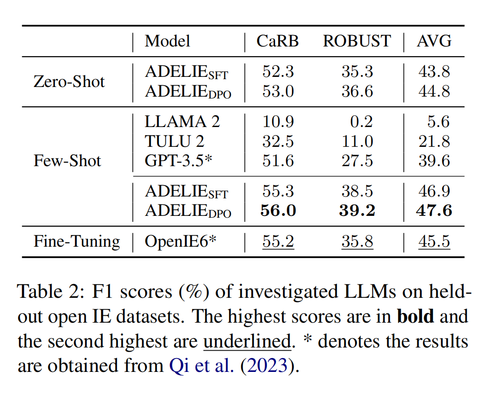

# Aligning Large Language Models on Information Extraction
<p align="center">
    <a href="https://arxiv.org/abs/2310.03668"></a>
    <a></a>
    <a></a>
</p>

<p align="justify">
We introduce <b>ADELIE</b> (<b>A</b>ligning large language mo<b>DEL</b>s on <b>I</b>nformation <b>E</b>xtraction), an aligned LLM that effectively solves various IE tasks, including closed IE, open IE, and on-demand IE. We first collect and construct a high-quality alignment corpus <font face="Verdana">IEInstruct</font> for IE. Then we train ADELIE<sub>SFT</sub> using instruction tuning on <font face="Verdana">IEInstruct</font>. We further train ADELIE<sub>SFT</sub> with direct preference optimization (DPO) objective, resulting in ADELIE<sub>DPO</sub>. Extensive experiments on various held-out IE datasets demonstrate that our models (ADELIE<sub>SFT</sub> and ADELIE<sub>DPO</sub>) achieve state-of-the-art (SoTA) performance among open-source models. We further explore the general capabilities of ADELIE, and experimental results reveal that their general capabilities do not exhibit a noticeable decline.

- 📖 Paper: [ADELIE: Aligning Large Language Models on Information Extraction](https://arxiv.org/abs/2405.05008)
- 🤖 ADELIE in the 🤗HuggingFace Hub: [THU-KEG/ADELIE]()
- 👍 IEInstruct and IEFeedback: [Datasets]()
</p>

<p align="center">

</p>

## Installation
The code repository is based on Pytorch and Transformers. Please use the following command to install the necessary dependcies. ``pip install -r requirements.txt.``

## Pretrained models
We release three ADELIE models based on [LLama-2](hhttps://huggingface.co/docs/transformers/main/model_doc/llama2) (7B). The models are available in the 🤗HuggingFace Hub.

| Model |   IE Average F1 (%) | General Average Score (%) |                     🤗HuggingFace Hub                     |
|---|:---------------------:|:--------------------:|:---------------------------------------------------------:|
| ADELIE-SFT |         47.5          |         53.5        |  [ADELIE-SFT]()  |
| ADELIE-DPO |         <b>47.7</b>          |         <b>53.8</b>        |  [ADELIE-DPO]()  |

## IEInstruct and IEFeedback

ADELIE<sub>SFT</sub> is trained on <font face="Verdana">IEInstruct</font>.
And it is further trained with direct preference optimization (DPO) objective on <font face="Verdana">IEFeedback</font>, resulting in ADELIE<sub>DPO</sub>.
You can download the data from [IEInstruct]() and [IEFeedback]().

## How to use ADELIE
Please Please take a look at our Example Jupyter Notebooks for instructions on ADELIE usage.

## Evaluation
### Colsed IE
<p align="center">

</p>

### Open IE
<p align="center">

</p>

### On-demand IE

<p align="center">

</p>

## Citation
```bibtex
@misc{qi2024adelie,
      title={ADELIE: Aligning Large Language Models on Information Extraction}, 
      author={Yunjia Qi and Hao Peng and Xiaozhi Wang and Bin Xu and Lei Hou and Juanzi Li},
      year={2024},
      eprint={2405.05008},
      archivePrefix={arXiv},
      primaryClass={cs.CL}
}
```