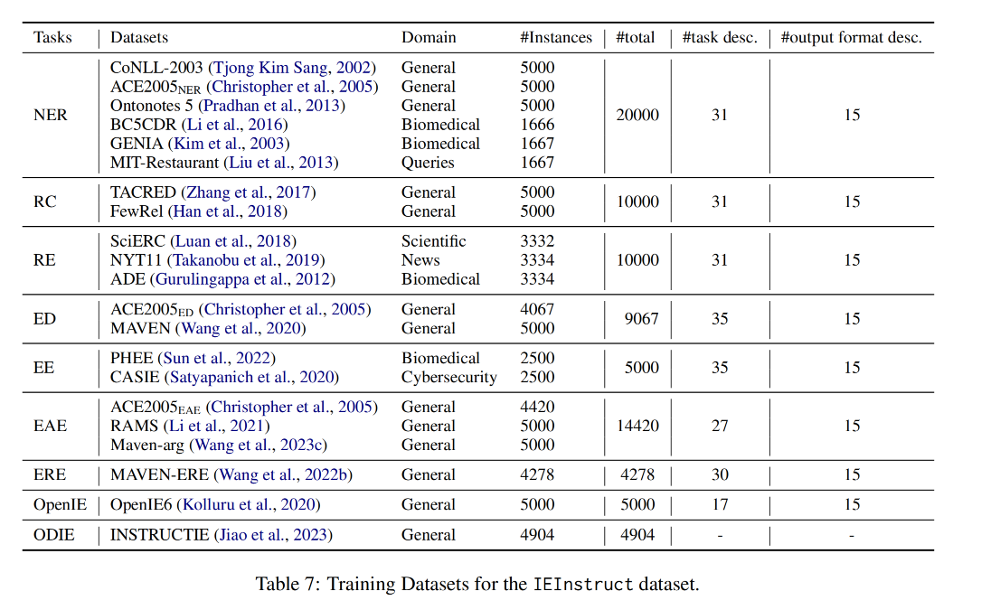

## Original Datasets
Our script is capable of processing the following datasets. 

Among our investigated tasks, the copyright of ``TACRED``, ``ACE 2005``, and ``RichERE`` belongs to ``LDC2`` and we access them through our LDC membership. All the other datasets are open-sourced, and we strictly adhere to their licenses.

### Prepare datasets for training and testing
<!-- Please run ``./scripts/prepare_original_datasets.sh`` to download the open-sourced dataset.
 
Or   -->
You can download the original data in this directory and modify the ``input_dir`` of the corresponding task in the ``./scripts/generate_unified_data.sh`` directory to generate the IEInstruct full version data set.